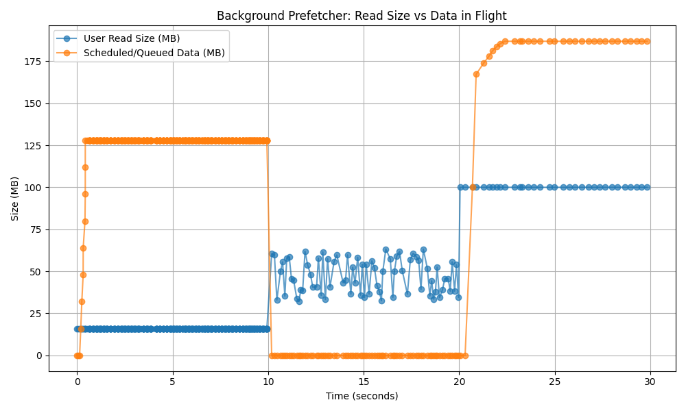

=================================================================
GCSFS Adaptive Concurrent Prefetching: Architecture & Usage Guide
=================================================================

This feature is entirely experimental! To activate, you need to pass the environment variable
`USE_EXPERIMENTAL_ADAPTIVE_PREFETCHING='true'` and `DEFAULT_GCSFS_CONCURRENCY`=4. As currently written, this implementation is
separate from the fsspec-style caching layer, but the intent is to eventually make this available to all
asynchronous filesystems using the standard `cache_type=` argument. How it interacts with the
existing cache types ("readahead", "first", etc.) remains to be decided, and in the meantime, use at your own risk.
We intend to develop more sophisticated caching strategies, perhaps specialised to file types.

Additional caveats:
- the bytes slicing/copying code uses low level (`ctypes`) calls and offloads to a dedicated thread for
performance. We intend to upstream some version of this to CPython, either in the slicing of `bytes.join()`
code, but in the meantime we are using this ad-hoc implementation. More work on zero-copy methods on bytes buffers is expected.
- the concurrent fetching code in `_cat_file_concurrent` is expected to be eventually upstreamed to the
google SDKs, since low-level connection management should be the concern of the communication layer.

Introduction to Prefetching in GCSFS
====================================

When reading large files from cloud storage, the biggest bottleneck is network latency. If a program reads a chunk of a file, processes it, and then asks for the next chunk, the application spends most of its time idle, waiting for data packets to travel across the internet.

Prefetching solves this by predicting what data the application will need next and downloading it in the background before the application actually asks for it. By overlapping computation with network I/O, we can keep the application fed with data and significantly reduce total execution time.

Alongside this new prefetching architecture, native concurrency support for reads is now part of gcsfs. Previously, file reads were largely sequential. Now, gcsfs can download, or stream a file concurrently reducing the read time.

Inspiration & Architectural Adaptations
=======================================

The core concept of this implementation is inspired by the Linux kernel's file system prefetching algorithm (mm/readahead.c). Like the kernel, our system establishes a sliding window of data ahead of the user's current read position and utilizes asynchronous pipelining fetching tomorrow's data while the application processes today's to hide I/O latency.

However, a cloud object store operates in a fundamentally different physical environment than a local NVMe drive. We made some architectural changes to adapt the kernel's philosophy for Google Cloud Storage:

* **Base Operational Unit:** The Linux kernel is fundamentally tied to the hardware's virtual memory system, operating on tiny, fixed 4KB pages. In contrast, cloud read workloads (like pandas or Parquet) request data in massive, variable sizes. Instead of operating on a fixed 4KB hardware constraint, our prefetcher treats the user's actual requested byte size (the "I/O Size," which could be 100MB) as the fundamental block size for all background operations. We implemented a ``RunningAverageTracker`` that continuously monitors the size of the user's recent read requests and dynamically scales the prefetch window to match their actual behavior.

* **Trigger Mechanisms:** Because the kernel operates on small chunks, it can afford to wait. It can comfortably let the application consume several 64KB chunks before asynchronously triggering the next fetch, because reading those few chunks takes microseconds. However, because our base block size is massive, we cannot afford to wait. Waiting for multiple 100MB chunks to process before initiating the next network call would stall the application waiting on TCP/TLS handshakes. Therefore, we trigger prefetching immediately upon the consumption of the first block. As soon as the consumer pulls that first block, the background producer evaluates the buffer and proactively pushes the next chunk requests to ensure the pipeline never runs dry.

* **Scaling Strategy (Linear vs. Exponential):** The Linux kernel typically ramps its prefetch window by aggressively doubling it (e.g., 2x, 4x). While this works flawlessly for local NVMe hardware where fetching from disk is incredibly fast and the penalty for over-fetching is practically zero, we explicitly abandoned exponential doubling for the cloud. In cloud object storage, fetching data across the internet is inherently slow, and network bandwidth is finite and expensive. If an exponential strategy blindly doubles a massive 50MB base request and pulls 100MB of unused data across the network before the application halts, that waste isn't just discarded RAM, it is wasted API calls, inflated cloud egress costs, and consumed network bandwidth. Furthermore, dedicating maximum HTTP concurrency to aggressively download unproven data turns the prefetcher into a "noisy neighbor," saturating the network interface and starving the core application of bandwidth it might need for other critical operations. To strictly control both fetch costs and network noise, our system scales linearly using a simple multiplier (``sequential_streak * io_size``). This provides exactly enough background concurrency to effectively hide network latency without recklessly queuing up massive, expensive network requests that might ultimately be thrown away.

* **Network Multiplexing vs. Hardware Queues:** The Linux kernel breaks a readahead window into physical memory pages (e.g., 4KB) and pushes them down to the block layer, ultimately relying on the physical hardware controller's queues (like NVMe multi-queue) to execute the I/O in parallel. In the cloud, there is no hardware controller to manage our parallelism, and a single HTTP stream is heavily bandwidth-capped. To saturate the network, the prefetcher must manufacture its own parallelism in software. Our ``PrefetchProducer`` dynamically calculates a ``split_factor`` to multiplex the prefetch window into several concurrent HTTP Range requests. By orchestrating these independent network streams directly within the Python ``asyncio`` event loop, the prefetcher actively brute-forces the bandwidth ceiling that would otherwise choke a single HTTP connection.

How the Prefetching Components Work
===================================

Here's how the prefetching works:

.. image:: _static/gcsfs_adaptive_prefetching.gif

The prefetching system is broken down into four distinct, decoupled components.

.. image:: _static/component.png

API Class Summary
------------------

* **``RunningAverageTracker``**: Monitors the byte sizes of the user's recent read requests. It calculates a rolling average to dynamically define the base I/O size, ensuring the engine scales to the current workload.
* **``PrefetchProducer``**: A background asyncio task that dictates network strategy. It calculates the ``prefetch_size`` and multiplexes the network stream by pushing concurrent download promises into a shared queue.
* **``PrefetchConsumer``**: Lives near the user application. It consumes background tasks from the queue, assembles the byte strings, and slices the exact data requested by the user while managing the local memory buffer.
* **``BackgroundPrefetcher``**: The main public orchestrator. It ties the producer and consumer together, routes file seek operations (managing soft vs. hard seeks), and ensures active network sockets and memory buffers are cleanly flushed upon closing.

Flow
----

Here is the visual how these components interact with each other:

.. image:: _static/flow.png

Interaction with GCSFile
========================

The prefetcher is integrated into the ``GCSFile`` and replaces the standard sequential fetching mechanism when enabled.

Enabling the Feature
--------------------

To use this architecture, set the following environment variables:

.. code-block:: bash

    export DEFAULT_GCSFS_CONCURRENCY=4
    export USE_EXPERIMENTAL_ADAPTIVE_PREFETCHING='true'

We recommend setting ``cache_type="none"`` for optimal results. The engine avoids prefetching for random workloads, and other cache types create unnecessary memory copies that degrade performance.

Under the Hood Lifecycle
------------------------

* During ``GCSFile.__init__``, if the feature is enabled, a ``BackgroundPrefetcher`` is instantiated and attached to ``self._prefetch_engine``.
* ``GCSFile._async_fetch_range`` is mapped directly to the prefetcher.
* When ``file.read(size)`` is called, it delegates to ``self._prefetch_engine._fetch(start, end)``.
* The prefetcher returns requested bytes from its local queue while the producer continues pulling chunks from GCS.
* Calling ``file.close()`` triggers ``_prefetch_engine.close()``, safely canceling pending network tasks and clearing memory buffers to prevent memory leaks.

Benchmarking with No Cache
--------------------------

Single Stream Performance (1 Process)
^^^^^^^^^^^^^^^^^^^^^^^^^^^^^^^^^^^^^

+---------+--------------+-----------------+-----------------+--------------------------+------------------+------------------+--------------------------+
| Pattern | IO Size (MB) | Default (MB/s)  | Concur. (MB/s)  | Prefetch+Concur. (MB/s)  | Default Mem (MB) | Concur. Mem (MB) | Prefetch+Concur Mem (MB) |
+=========+==============+=================+=================+==========================+==================+==================+==========================+
| seq     | 0.06         | 1.66            | 1.69            | 208.14                   | 150.07           | 150.24           | 244.43                   |
+---------+--------------+-----------------+-----------------+--------------------------+------------------+------------------+--------------------------+
| seq     | 1.00         | 23.69           | 23.43           | 658.71                   | 150.33           | 150.49           | 544.21                   |
+---------+--------------+-----------------+-----------------+--------------------------+------------------+------------------+--------------------------+
| seq     | 16.00        | 156.36          | 219.48          | 736.58                   | 174.31           | 209.91           | 622.55                   |
+---------+--------------+-----------------+-----------------+--------------------------+------------------+------------------+--------------------------+
| seq     | 100.00       | 205.48          | 416.17          | 507.18                   | 415.75           | 520.14           | 752.66                   |
+---------+--------------+-----------------+-----------------+--------------------------+------------------+------------------+--------------------------+
| rand    | 0.06         | 1.38            | 1.31            | 1.36                     | 151.05           | 151.03           | 151.00                   |
+---------+--------------+-----------------+-----------------+--------------------------+------------------+------------------+--------------------------+
| rand    | 1.00         | 18.01           | 19.49           | 18.84                    | 151.50           | 151.23           | 151.03                   |
+---------+--------------+-----------------+-----------------+--------------------------+------------------+------------------+--------------------------+
| rand    | 16.00        | 142.53          | 164.97          | 173.44                   | 175.44           | 195.93           | 192.45                   |
+---------+--------------+-----------------+-----------------+--------------------------+------------------+------------------+--------------------------+
| rand    | 100.00       | 201.72          | 394.35          | 399.80                   | 423.78           | 534.98           | 545.19                   |
+---------+--------------+-----------------+-----------------+--------------------------+------------------+------------------+--------------------------+

Multi Stream Performance (48 Process)
^^^^^^^^^^^^^^^^^^^^^^^^^^^^^^^^^^^^^

+---------+--------------+-----------------+-----------------+--------------------------+------------------+------------------+--------------------------+
| Pattern | IO Size (MB) | Default (MB/s)  | Concur. (MB/s)  | Prefetch+Concur. (MB/s)  | Default Mem (MB) | Concur. Mem (MB) | Prefetch+Concur Mem (MB) |
+=========+==============+=================+=================+==========================+==================+==================+==========================+
| seq     | 0.06         | 103.06          | 100.12          | 6427.04                  | 6395.91          | 6566.95          | 10260.48                 |
+---------+--------------+-----------------+-----------------+--------------------------+------------------+------------------+--------------------------+
| seq     | 1.00         | 1493.46         | 1457.01         | 14751.12                 | 6549.40          | 6381.80          | 19975.98                 |
+---------+--------------+-----------------+-----------------+--------------------------+------------------+------------------+--------------------------+
| seq     | 16.00        | 7321.71         | 10604.33        | 17088.18                 | 7596.40          | 8600.75          | 23418.01                 |
+---------+--------------+-----------------+-----------------+--------------------------+------------------+------------------+--------------------------+
| seq     | 100.00       | 8427.14         | 13033.72        | 15004.08                 | 14987.33         | 18409.79         | 23167.73                 |
+---------+--------------+-----------------+-----------------+--------------------------+------------------+------------------+--------------------------+
| rand    | 0.06         | 94.47           | 91.70           | 92.79                    | 6418.76          | 6397.77          | 6617.16                  |
+---------+--------------+-----------------+-----------------+--------------------------+------------------+------------------+--------------------------+
| rand    | 1.00         | 1233.89         | 1248.04         | 1269.04                  | 6358.52          | 6438.66          | 6525.85                  |
+---------+--------------+-----------------+-----------------+--------------------------+------------------+------------------+--------------------------+
| rand    | 16.00        | 6216.86         | 9286.27         | 9374.38                  | 7625.34          | 8519.78          | 8627.13                  |
+---------+--------------+-----------------+-----------------+--------------------------+------------------+------------------+--------------------------+
| rand    | 100.00       | 8932.10         | 12550.82        | 12968.84                 | 15041.77         | 18421.29         | 18508.52                 |
+---------+--------------+-----------------+-----------------+--------------------------+------------------+------------------+--------------------------+

Benchmarking with ReadAhead Cache
---------------------------------

Single Stream Performance (1 Process)
^^^^^^^^^^^^^^^^^^^^^^^^^^^^^^^^^^^^^

+---------+--------------+-----------------+-----------------+--------------------------+------------------+------------------+--------------------------+
| Pattern | IO Size (MB) | Default (MB/s)  | Concur. (MB/s)  | Prefetch+Concur. (MB/s)  | Default Mem (MB) | Concur. Mem (MB) | Prefetch+Concur Mem (MB) |
+=========+==============+=================+=================+==========================+==================+==================+==========================+
| seq     | 0.06         | 78.16           | 86.38           | 523.89                   | 150.64           | 150.61           | 611.31                   |
+---------+--------------+-----------------+-----------------+--------------------------+------------------+------------------+--------------------------+
| seq     | 1.00         | 100.23          | 109.25          | 758.56                   | 150.46           | 150.50           | 578.07                   |
+---------+--------------+-----------------+-----------------+--------------------------+------------------+------------------+--------------------------+
| seq     | 16.00        | 139.03          | 187.91          | 586.25                   | 214.49           | 227.27           | 622.75                   |
+---------+--------------+-----------------+-----------------+--------------------------+------------------+------------------+--------------------------+
| seq     | 100.00       | 190.21          | 337.83          | 177.71                   | 600.24           | 634.02           | 799.69                   |
+---------+--------------+-----------------+-----------------+--------------------------+------------------+------------------+--------------------------+
| rand    | 0.06         | 0.91            | 0.86            | 0.93                     | 151.07           | 151.23           | 150.81                   |
+---------+--------------+-----------------+-----------------+--------------------------+------------------+------------------+--------------------------+
| rand    | 1.00         | 13.76           | 15.27           | 16.12                    | 150.89           | 150.59           | 151.14                   |
+---------+--------------+-----------------+-----------------+--------------------------+------------------+------------------+--------------------------+
| rand    | 16.00        | 115.72          | 168.69          | 166.08                   | 225.39           | 244.38           | 249.50                   |
+---------+--------------+-----------------+-----------------+--------------------------+------------------+------------------+--------------------------+
| rand    | 100.00       | 201.14          | 353.14          | 344.58                   | 532.25           | 640.24           | 646.37                   |
+---------+--------------+-----------------+-----------------+--------------------------+------------------+------------------+--------------------------+

Multi Stream Performance (48 Process)
^^^^^^^^^^^^^^^^^^^^^^^^^^^^^^^^^^^^^

+---------+--------------+-----------------+-----------------+--------------------------+------------------+------------------+--------------------------+
| Pattern | IO Size (MB) | Default (MB/s)  | Concur. (MB/s)  | Prefetch+Concur. (MB/s)  | Default Mem (MB) | Concur. Mem (MB) | Prefetch+Concur Mem (MB) |
+=========+==============+=================+=================+==========================+==================+==================+==========================+
| seq     | 0.06         | 3714.63         | 4836.03         | 13159.98                 | 6473.32          | 6451.69          | 23453.56                 |
+---------+--------------+-----------------+-----------------+--------------------------+------------------+------------------+--------------------------+
| seq     | 1.00         | 5181.51         | 5938.07         | 13595.90                 | 6558.29          | 6464.87          | 23465.71                 |
+---------+--------------+-----------------+-----------------+--------------------------+------------------+------------------+--------------------------+
| seq     | 16.00        | 6364.01         | 8241.61         | 8685.56                  | 9603.04          | 10482.20         | 26589.36                 |
+---------+--------------+-----------------+-----------------+--------------------------+------------------+------------------+--------------------------+
| seq     | 100.00       | 7933.12         | 9073.42         | 6559.75                  | 21102.71         | 24100.92         | 34867.50                 |
+---------+--------------+-----------------+-----------------+--------------------------+------------------+------------------+--------------------------+
| rand    | 0.06         | 49.31           | 50.49           | 55.03                    | 6470.39          | 6403.98          | 6513.27                  |
+---------+--------------+-----------------+-----------------+--------------------------+------------------+------------------+--------------------------+
| rand    | 1.00         | 753.51          | 796.78          | 891.93                   | 6379.23          | 6519.89          | 6293.09                  |
+---------+--------------+-----------------+-----------------+--------------------------+------------------+------------------+--------------------------+
| rand    | 16.00        | 5864.85         | 7647.61         | 7868.37                  | 10027.41         | 11680.56         | 11808.40                 |
+---------+--------------+-----------------+-----------------+--------------------------+------------------+------------------+--------------------------+
| rand    | 100.00       | 8276.16         | 10171.59        | 10172.54                 | 20621.17         | 23598.05         | 24086.18                 |
+---------+--------------+-----------------+-----------------+--------------------------+------------------+------------------+--------------------------+

Seeing the Prefetcher in Action
===============================

Real-world applications rarely do just one thing; they often switch between entirely different reading patterns mid-file. To understand how the engine balances aggressive fetching with careful memory management, we can look at a dynamic workload transition.

The graph below plots the size of the data requested by the application (User Read Size) against the volume of data the prefetcher is fetching in the background (Scheduled/Queued Data).

Notice how the prefetcher mirrors the application's behaviour across three distinct phases:

1. **Sequential reading (0–10s):** The application starts by reading 16MB chunks. After three reads, the prefetcher ramps up its background fetching. It maintains a buffer ahead of the application so the user never waits on the network.
2. **Random seeks (10–20s):** The application starts jumping randomly around the file. Prefetching would be harmful here. The engine detects the broken streak and drops the background buffer to zero, ensuring no network bandwidth or memory is wasted downloading data.
3. **Larger sequential reads (20–30s):** The application resumes reading sequentially, but this time stepping up to 100MB chunks. The algorithm detects the new streak, calculates the new rolling average, and rebuilds the background buffer—this time scaling it up to handle the larger data chunks.
