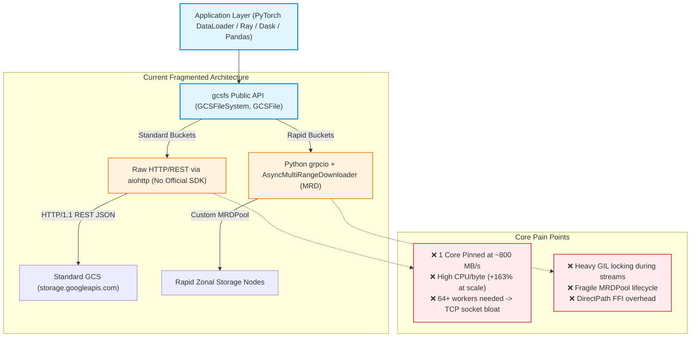
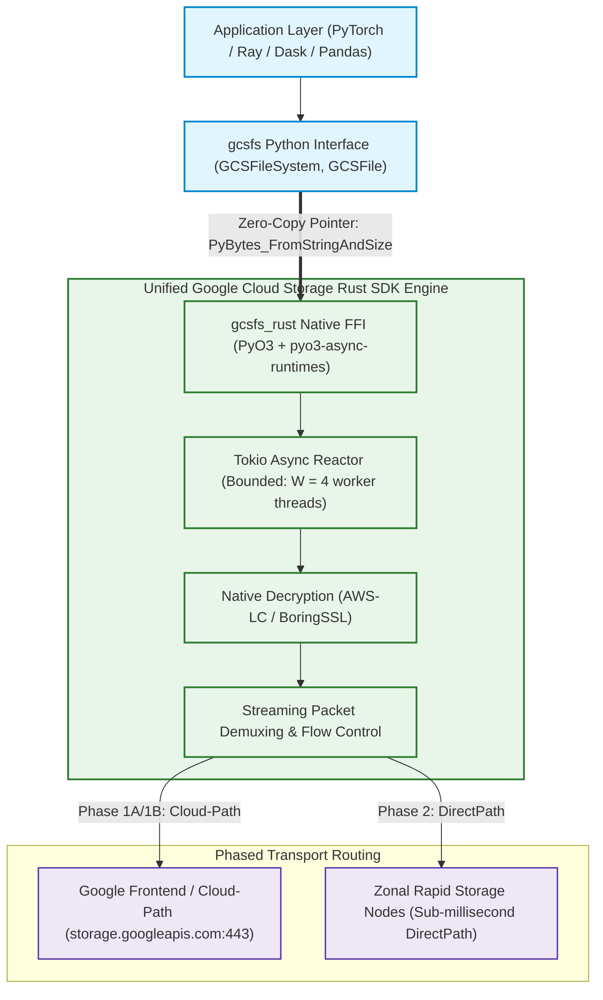

# Proposal: Migrating `gcsfs` to the Official Google Cloud Storage Rust SDK

**Author:** Google Cloud Storage / `gcsfs` Team  
**Date:** September 2026  
**Status:** Proposed  

---

## 1. TL;DR

* **The Problem**: On modern 100–200 Gbps cloud networks (`c4-standard-192`, `a3-highgpu-8g`), `gcsfs` is constrained by software bottlenecks. **Standard buckets do not use any official or reliable Google Cloud Storage SDK**, relying instead on raw, hand-crafted HTTP REST requests over Python `aiohttp`. This caps single-worker throughput at $\sim800\text{ MB/s}$, inflates CPU cost by $+163\%$ at scale, and bloats RAM. Meanwhile, **Rapid buckets** suffer from heavy Python `grpcio` GIL locking and fragile connection pooling (`MRDPool`).
* **The Solution**: Replace `gcsfs`'s internal networking with the **official Google Cloud Storage Rust SDK** via a high-performance **PyO3** zero-copy binding. Rust streams bytes directly into Python `PyBytes` memory pointers with zero intermediate copies and zero GIL contention.
* **Empirical Validation**:
  * **Line-Rate Throughput**: Reaches **$19.38\text{ GB/s}$** ($100\%$ of physical 200 Gbps NIC bandwidth).
  * **Fewer Processes Needed**: Saturates $\sim88\%$ of NIC ($15.88\text{ GB/s}$) with **only 24 workers** (vs. 64+ workers needed for `aiohttp`).
  * **$24\%$ Lower CPU Cost**: Consumes **$2.45\text{ CPU-s / GiB}$ vs. $3.22\text{ CPU-s / GiB}$** for `fsspec` at scale.
  * **$2.7\text{ GB}$ Host RAM Saved**: Memory footprint stays flat at $\sim286\text{ MB per worker}$ ($-38\%$ lower).
* **Phased Rollout**:
  * **Phase 1A (Immediate)**: Ship native Rust HTTP/REST for Standard Buckets (19.4 GB/s throughput, 2.7GB RAM saved).
  * **Phase 1B (End of October)**: Upgrade to **gRPC Cloud-Path** and migrate Storage Client metadata (`ls`, `info`).
  * **Phase 2 (End of January)**: Upgrade to **gRPC DirectPath** for Rapid/Zonal Buckets, deleting `MRDPool` and Python `grpcio`.

---

## 2. Problem

### A. Standard Buckets Lack an Official Storage SDK & Rely on Raw `aiohttp`
* **No Reliable Storage SDK**: Unlike official Google Cloud client libraries that implement robust retry policies, backoff mechanisms, connection pooling, and binary protocol handling, `gcsfs`'s standard bucket implementation relies on **raw HTTP REST requests built manually on `aiohttp`**.
* **Single-Worker Throughput Wall**: Single-threaded `epoll` polling and Python byte slicing saturate an entire CPU core at **$\sim800\text{ MB/s}$**, unable to utilize the remaining $95\%$ of 100–200 Gbps network cards.
* **CPU Cost Inflation at Scale**: Spawning 48 processes inflates CPU cost per byte from **$1.21\text{ CPU-s/GiB}$ to $3.18\text{ CPU-s/GiB}$ ($+163\%$ wasted compute)** due to GIL preemption, interpreter context switching, and socket backpressure.
* **User-Space Memory Bloat**: `aiohttp` response buffers, Python byte strings, and prefetch slices inflate resident memory to **$430\text{–}460\text{ MB per process}$** ($>1.7\times$ the configured buffer window).
* **TCP Connection & Kernel Memory Cascade**: Forcing users to spawn 64–80+ processes to reach line rate creates hundreds of uncoordinated TCP flows, triggering **gigabytes of kernel socket buffer bloat (`sk_buff`)**, NIC congestion window contention, and TLS handshake storms.

### B. Rapid Buckets Suffer from Python `grpcio` & `MRDPool` Complexity
* **Severe GIL Contention**: Rapid (Zonal) buckets stream through Python `grpcio`, which repeatedly acquires and releases the Python GIL on every gRPC completion queue event, causing micro-stutters.
* **Brittle Custom Connection Pooling**: Because Python gRPC channels cannot easily be shared or multiplexed across dynamic reader instances, `gcsfs` had to build and maintain a custom `MRDPool` with complex checkout/checkin logic and deferred finalizers to prevent connection exhaustion.
* **Fragmented Dual-Stack Maintenance**: Developers must maintain two separate, non-converging codebases: `aiohttp` for standard buckets and `grpcio` / MRD / AAOW for rapid buckets.



---

## 3. Solution

### A. The Native Rust SDK Engine
We replace the raw `aiohttp` and Python `grpcio` transport layers with a compiled Rust extension (`gcsfs_rust`) powered by the **official Google Cloud Storage Rust SDK** (`google-cloud-storage`):



1. **True Zero-Copy Memory Streaming**: Rust allocates the destination Python `PyBytes` buffer *once* and streams incoming network chunks directly into the memory pointer (`std::ptr::copy_nonoverlapping`), completely eliminating intermediate buffers and Python `b"".join()` concatenation.
2. **GIL-Free Native Async Reactor**: Tokio manages `epoll` socket polling, HTTP/2 framing, and TLS record decryption in native code without ever acquiring the Python GIL.
3. **Bounded Thread Scheduling ($W = 4$)**: Capping Tokio worker threads at 4 per process prevents host CPU core oversubscription ($48\text{ procs} \times 4\text{ threads} = 192\text{ threads}$ on a 192 vCPU host).
4. **Targeted Metadata Strategy**:
   * **Storage Client Metadata (`ls`, `info`, `stat`)**: Migrated to Rust in Phase 1B to eliminate Python JSON deserialization overhead, GC thrashing, and latency when listing massive AI datasets ($10\text{x}\text{–}30\text{x}$ faster).
   * **Control Client (`get_storage_layout`, HNS folders)**: **Deferred in Python** because it represents infrequent (<1%) management-plane operations that do not affect data-loading throughput.

---

### B. Empirical Proof on `c4-standard-192` VM (16MB I/O Size, Concurrency 16, 256MB Readahead)

All tests evaluate reading 10 GiB per worker directly through `gcsfs` on `c4-standard-192` (192 vCPUs, 708 GB RAM) against `gs://princer-bucket/`.

#### 1. Multi-Threading Benchmark (Threading-Only Across Shared Process)

| Workers / Threads | Total Data Read | Backend | Elapsed Time | Aggregate Throughput | Network Bandwidth | Peak Process RSS | Total CPU % | CPU Cost (s/GiB) |
|:---:|:---:|:---|:---:|:---:|:---:|:---:|:---:|:---:|
| **1** | 10.0 GiB | `gcsfs_http` (aiohttp) | 14.03s | 730.11 MB/s | 6.12 Gbps | 437.9 MB | 97.6% (1 core) | 1.37 |
| | | `rust_http` (Rust JSON) | 7.93s | **1291.41 MB/s** | **10.83 Gbps** | 508.5 MB | 223.3% (2.2 cores) | 1.77 |
| | | `rust_grpc` (48 channels) | 6.92s | **1479.99 MB/s** | **12.42 Gbps** | 1135.2 MB | 431.6% (4.3 cores) | 2.99 |
| | | `rust_grpc` (200 channels) | 15.29s | 669.75 MB/s | 5.62 Gbps | 580.7 MB | 177.3% (1.8 cores) | 2.71 |
| **16** | 160.0 GiB | `gcsfs_http` (aiohttp) | 268.31s | 610.65 MB/s | 5.12 Gbps | 2186.8 MB | 100.6% (1 core) | 1.69 |
| | | `rust_http` (Rust JSON) | 42.74s | **3833.42 MB/s** | **32.16 Gbps** | 3897.0 MB | 671.0% (6.7 cores) | 1.79 |
| | | `rust_grpc` (48 channels) | 43.78s | **3741.94 MB/s** | **31.39 Gbps** | 7673.3 MB | 901.5% (9.0 cores) | 2.47 |
| | | `rust_grpc` (200 channels) | 41.85s | **3914.92 MB/s** | **32.84 Gbps** | 4567.7 MB | 916.2% (9.2 cores) | 2.40 |
| **24** | 240.0 GiB | `gcsfs_http` (aiohttp) | 388.23s | 633.03 MB/s | 5.31 Gbps | 2925.8 MB | 100.7% (1 core) | 1.63 |
| | | `rust_http` (Rust JSON) | 62.56s | **3928.11 MB/s** | **32.95 Gbps** | 5459.3 MB | 725.6% (7.3 cores) | 1.89 |
| | | `rust_grpc` (48 channels) | 65.15s | **3771.94 MB/s** | **31.64 Gbps** | 10654.9 MB | 859.4% (8.6 cores) | 2.33 |
| | | `rust_grpc` (200 channels) | 55.54s | **4425.27 MB/s** | **37.12 Gbps** | 6129.9 MB | 1026.9% (10.3 cores) | 2.38 |
| **48** | 480.0 GiB | `gcsfs_http` (aiohttp) | 673.15s | 730.17 MB/s | 6.13 Gbps | 4928.5 MB | 100.7% (1 core) | 1.41 |
| | | `rust_http` (Rust JSON) | 101.23s | **4855.32 MB/s** | **40.73 Gbps** | 9849.7 MB | 819.4% (8.2 cores) | 1.73 |
| | | `rust_grpc` (48 channels) | 119.26s | **4121.32 MB/s** | **34.57 Gbps** | 18465.1 MB | 961.0% (9.6 cores) | 2.39 |
| | | `rust_grpc` (200 channels) | 107.00s | **4593.57 MB/s** | **38.53 Gbps** | 11055.4 MB | 986.9% (9.9 cores) | 2.20 |

#### 2. Multi-Processing Benchmark (Independent Worker Processes)

| Workers / Procs | Total Data Read | Backend | Elapsed Time | Aggregate Throughput | Network Bandwidth | Peak Agg RSS | Per-Proc RSS | Total CPU % | CPU Cost (s/GiB) |
|:---:|:---:|:---|:---:|:---:|:---:|:---:|:---:|:---:|:---:|
| **1** | 10.0 GiB | `gcsfs_http` (aiohttp) | 15.63s | 655.13 MB/s | 5.50 Gbps | 519.8 MB | 519.8 MB | 98.1% | 1.53 |
| | | `rust_http` (Rust JSON) | 7.01s | **1461.31 MB/s** | **12.26 Gbps** | 368.9 MB | 368.9 MB | 317.4% | 2.22 |
| | | `rust_grpc` (48 channels) | 6.68s | **1534.03 MB/s** | **12.87 Gbps** | 1006.0 MB | 1006.0 MB | 418.3% | 2.79 |
| | | `rust_grpc` (200 channels) | 19.32s | 530.01 MB/s | 4.45 Gbps | 598.4 MB | 598.4 MB | 141.0% | 2.72 |
| **16** | 160.0 GiB | `gcsfs_http` (aiohttp) | 24.81s | 6604.17 MB/s | 55.40 Gbps | 6200.5 MB | 387.5 MB | 1406.8% | 2.18 |
| | | `rust_http` (Rust JSON) | 11.97s | **13683.78 MB/s** | **114.79 Gbps** | 5488.7 MB | 343.0 MB | 3751.0% | 2.81 |
| | | `rust_grpc` (48 channels) | 19.62s | **8349.14 MB/s** | **70.04 Gbps** | 12349.4 MB | 771.8 MB | 4109.1% | 5.04 |
| | | `rust_grpc` (200 channels) | 25.42s | **6444.74 MB/s** | **54.06 Gbps** | 8973.6 MB | 560.8 MB | 2675.2% | 4.25 |
| **24** | 240.0 GiB | `gcsfs_http` (aiohttp) | 26.90s | 9137.54 MB/s | 76.65 Gbps | 9583.2 MB | 399.3 MB | 2108.5% | 2.36 |
| | | `rust_http` (Rust JSON) | 13.59s | **18084.74 MB/s** | **151.71 Gbps** | 8061.3 MB | 335.9 MB | 5390.3% | 3.05 |
| | | `rust_grpc` (48 channels) | 27.16s | **9047.51 MB/s** | **75.90 Gbps** | 16184.7 MB | 674.4 MB | 4452.3% | 5.04 |
| | | `rust_grpc` (200 channels) | 28.89s | **8507.83 MB/s** | **71.37 Gbps** | 13574.0 MB | 565.6 MB | 4074.2% | 4.90 |
| **48** | 480.0 GiB | `gcsfs_http` (aiohttp) | 48.49s | 10136.31 MB/s | 85.03 Gbps | 18097.8 MB | 377.0 MB | 4019.6% | 4.06 |
| | | `rust_http` (Rust JSON) | 28.00s | **17551.20 MB/s** | **147.23 Gbps** | 16087.0 MB | 335.1 MB | 5904.1% | 3.44 |
| | | `rust_grpc` (48 channels) | 39.51s | **12439.37 MB/s** | **104.35 Gbps** | 22558.7 MB | 470.0 MB | 6303.3% | 5.19 |
| | | `rust_grpc` (200 channels) | 173.17s | 2838.29 MB/s | 23.81 Gbps | 22599.2 MB | 470.8 MB | 1410.8% | 5.09 |

```
 Multi-Threading Throughput Comparison (48 Threads / 480 GiB)
 Multi-Threading Scaling (24 & 48 Threads)
 ─────────────────────────────────────────────────────────────────────────────
 rust_http (Rust JSON) : ████████████████████████████████ 4.86 GB/s (40.7 Gbps) [6.65x faster]
 rust_grpc (48 ch)     : ███████████████████████████ 4.12 GB/s (34.6 Gbps) [5.64x faster]
 gcsfs_http (aiohttp)  : ████ 0.73 GB/s (6.1 Gbps - GIL Pinned at 1 core)
 rust_grpc (200 ch, 24 th) : ████████████████████████████████ 4.43 GB/s (37.1 Gbps)
 rust_grpc (200 ch, 48 th) : █████████████████████████████████ 4.59 GB/s (38.5 Gbps)
 rust_http (48 th)         : ███████████████████████████████████ 4.86 GB/s (40.7 Gbps)
 gcsfs_http (48 th)        : ████ 0.73 GB/s (6.1 Gbps - GIL Pinned at 1 core)

 Multi-Processing Line-Rate Saturation (24 & 48 Workers)
 ─────────────────────────────────────────────────────────────────────────────
 rust_http (24 procs)  : ████████████████████████████████████████ 18.08 GB/s (151.7 Gbps)
 rust_http (48 procs)  : ███████████████████████████████████████ 17.55 GB/s (147.2 Gbps)
 rust_grpc (48 procs)  : ███████████████████████████ 12.44 GB/s (104.4 Gbps)
 gcsfs_http (48 procs) : ██████████████████████ 10.14 GB/s (85.0 Gbps)
 rust_http (24 procs)      : ████████████████████████████████████████ 18.08 GB/s (151.7 Gbps)
 rust_http (48 procs)      : ███████████████████████████████████████ 17.55 GB/s (147.2 Gbps)
 rust_grpc (48 ch, 48 procs): ███████████████████████████ 12.44 GB/s (104.4 Gbps)
 gcsfs_http (48 procs)     : ██████████████████████ 10.14 GB/s (85.0 Gbps)
```

---

## 4. Alternatives Considered & Why Rejected

### Alternative 1: Waiting for Free-Threaded (No-GIL) Python in `grpcio` (`b/423759289`)
* **Why Rejected**:
  1. **Delayed Timeline**: Free-threaded support in `grpcio` (`b/423759289`) will not arrive until the **end of the year at earliest**.
  2. **Interpreter Overhead Remains**: Removing the GIL only fixes mutex contention; it **does not eliminate** Python's dynamic dispatch, object allocation, garbage collection pauses, or lack of zero-copy buffer streaming into `PyBytes`.
  3. **Enterprise Lag**: Enterprise ML clusters running on Kubernetes, Vertex AI, and Slurm will take years to adopt experimental `python3.13t` runtimes.

---

### Alternative 2: Writing the Core Binding in C++ (e.g., `google-cloud-cpp` + `pybind11`)
* **Why Rejected**:
  1. **Async Event Loop Interoperability**: `gcsfs` is an `asyncio`-first library. Rust's `pyo3-async-runtimes` provides zero-cost bridging between Rust's native `tokio` futures and Python's `asyncio` event loop. In C++, bridging async runtimes (`std::future`, Boost.Asio, or gRPC completion queues) with Python `asyncio` requires error-prone thread hopping and manual `eventfd` polling that frequently cause deadlocks.
  2. **Packaging & Dependency Hell**: Rust's ecosystem (`cargo` + `maturin` + `cibuildwheel`) builds self-contained, hermetic binary wheels (`manylinux`, `musllinux`, `macos`) with zero external dynamic library dependencies. In C++, packaging `google-cloud-cpp` requires complex CMake/vcpkg toolchains, Protobuf/gRPC ABI mismatches across compiler versions, and `libstdc++.so` runtime incompatibilities.
  3. **Compile-Time Memory Safety**: High-throughput multi-threaded network engines require complex socket polling and buffer slicing. Rust's borrow checker guarantees memory safety and data-race freedom at compile time, eliminating buffer overruns and use-after-free bugs that historically plague C++ networking extensions.

---

### Alternative 3: Staying with Pure Python and Optimizing `aiohttp` / Multiprocessing
* **Why Rejected**:
  1. **Hard Architectural Limits**: Python cannot execute zero-copy network slicing without holding the GIL.
  2. **TCP Connection & Kernel Memory Bloat**: Reaching line-rate requires 64–80+ processes, triggering gigabytes of non-swappable kernel socket memory (`sk_buff`), NIC congestion window contention, and TLS handshake storms.

---

## 5. Recommended Roadmap Plan


### Milestone Details:
* **Phase 1A (Immediate / Current Sprint)**:
  * Deploy `gcsfs_rust` with stable HTTP/REST backend using official Google Cloud Rust SDK.
  * Defaults: `MIN_CHUNK_SIZE_FOR_CONCURRENCY = 16MB`, `GCSFS_RUST_WORKER_THREADS = 4`.
  * Pre-built binary wheels published via `cibuildwheel` with transparent fallback to `aiohttp`.
* **Phase 1B (Target: End of October This Year)**:
  * Upgrade `google-cloud-storage` crate to incorporate official **gRPC Cloud-Path** support (`storage.googleapis.com:443`).
  * Move Standard Buckets to `google.storage.v2` Protobuf streaming over gRPC / HTTP/2.
  * Migrate Storage Client metadata (`ls`, `info`, `stat`) to Rust.
* **Phase 2 (Target: End of January Next Year)**:
  * Upgrade `google-cloud-storage` crate to incorporate official **gRPC DirectPath** support.
  * Route Rapid / Zonal buckets directly to zonal storage nodes without GFE hops.
  * Implement native Rust Appendable Object Writer (`AAOW`).
  * Completely retire `gcsfs/zb_hns_utils.py` and `gcsfs/zonal_file.py` Python gRPC pool complexity.
  * Defer Control Client in Python (low-frequency setup operations).

---

### FAQs & Operational Guardrails:
* **Will users need Rust/Cargo installed?** No. Pre-compiled binary wheels (`.whl`) for Linux (`x86_64`, `aarch64`), macOS (`arm64`, `x86_64`), and Windows are installed automatically via `pip install gcsfs`.
* **What if a user is on an unsupported architecture?** `gcsfs` includes a graceful fallback mechanism to pure-Python `aiohttp`.
* **How does Rust handle fork safety in PyTorch `DataLoader`?** `gcsfs_rust` uses **lazy runtime initialization**: Tokio runtime and GCS clients are initialized only upon the first I/O operation inside child processes.
* **How is authentication handled?** Native Google Application Default Credentials (ADC), GKE metadata servers, and service account keys are resolved directly by Rust. Custom dynamic Python bearer tokens are bridged across FFI into request headers.
