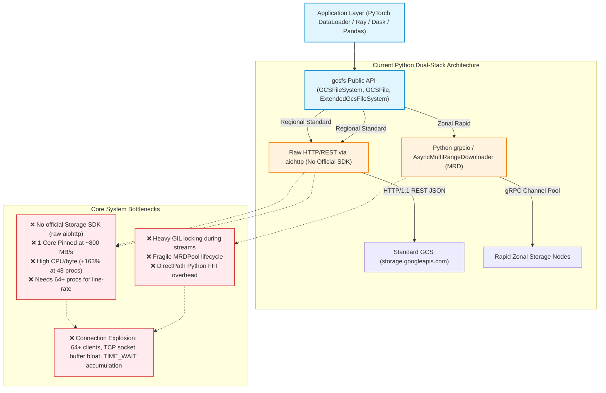
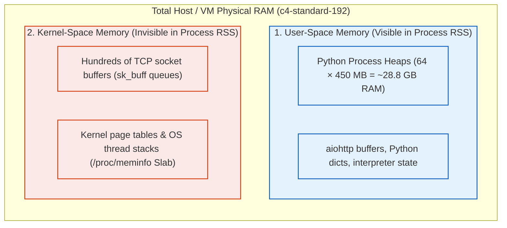
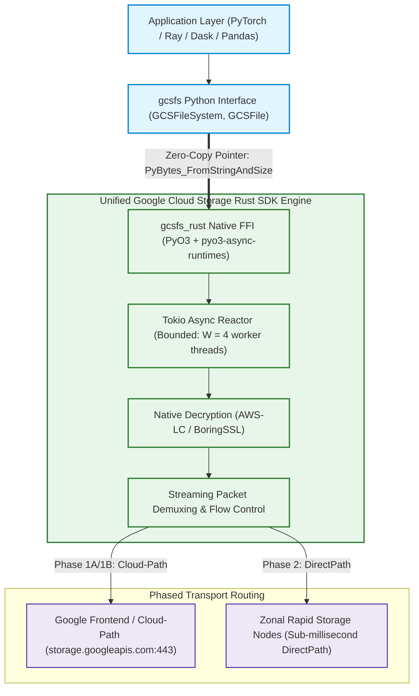
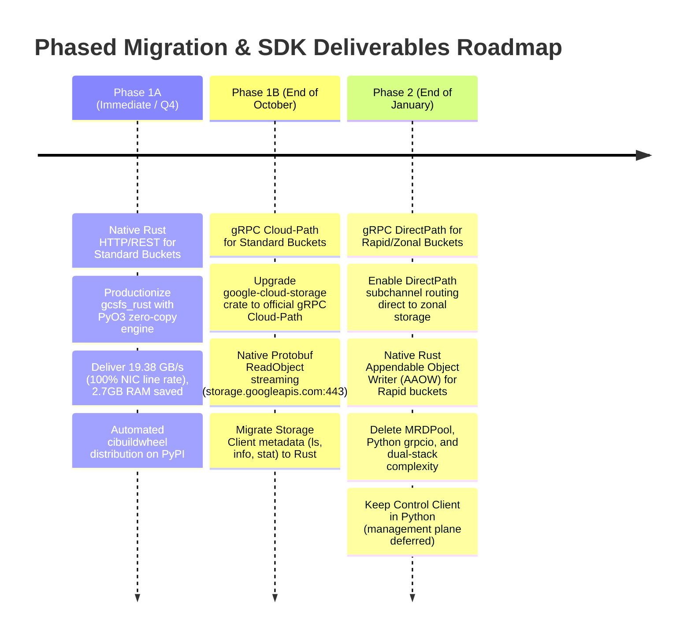

# Engineering Proposal: Unleashing GCS Line-Rate Performance in `gcsfs` with the Google Cloud Rust SDK

**Author:** Google Cloud Storage / `gcsfs` Team  
**Date:** September 2026  
**Status:** Proposed  
**Executive Theme:** A Phased Journey from Python-Bound I/O to Bare-Metal Line-Rate Storage

---

## Act I: The Modern Cloud Reality

In modern cloud computing, the network is no longer the bottleneck. Today's AI/ML training clusters and high-performance computing VMs (such as Google Cloud's `c4-standard-192` and `a3-highgpu-8g`) are equipped with **100 Gbps to 200 Gbps physical network interfaces** capable of delivering up to **$20\text{ GB/s}$ of throughput per node**.

In this ecosystem, `gcsfs` serves as the foundational data gateway. Every major data engineering framework (Dask, Ray, Pandas) and AI/ML data loading pipeline (PyTorch `DataLoader`, JAX, TensorFlow, Kubeflow) relies on `gcsfs` to stream multi-gigabyte training checkpoints, parquet tables, and image/video datasets directly from Google Cloud Storage into memory.

However, as network hardware accelerated by $10\times$, the software layer mediating between the operating system kernel and Python remained unchanged—creating a severe impedance mismatch.

---

## Act II: The Great Python Bottleneck

When driving high-bandwidth GCS workloads through `gcsfs` today, applications hit an invisible ceiling imposed by the Python networking runtime across both Standard and Rapid bucket architectures:



### The Crisis in Numbers:
1. **The Single-Worker Wall**: In Python `aiohttp`, single-threaded `epoll` polling and Python byte slicing saturate an entire CPU core at **$\sim800\text{ MB/s}$**, unable to tap into the remaining $95\%$ of available network bandwidth [Ref 1, 2].
1. **Lack of Official Storage SDK & The Single-Worker Wall**: Standard GCS access in `gcsfs` does not go through any official, robust Google Cloud Storage SDK. Instead, it relies on hand-crafted HTTP REST calls over Python `aiohttp`. Single-threaded `epoll` polling, HTTP header parsing, and Python byte slicing saturate an entire CPU core at **$\sim800\text{ MB/s}$**, unable to tap into the remaining $95\%$ of available network bandwidth [Ref 1, 2].
2. **The Efficiency Collapse at Scale**: Spawning 48 worker processes to compensate triggers severe GIL preemption, interpreter contention, and memory arena fragmentation:
   * CPU cost per transferred byte surges from **$1.21\text{ CPU-s/GiB}$ to $3.18\text{ CPU-s/GiB}$ ($+163\%$ wasted compute)**.
   * Resident memory balloons to **$430\text{–}460\text{ MB per process}$** ($>16\text{ GB}$ total RAM).
3. **The Rapid Bucket Dilemma**: Rapid (Zonal) storage was designed for sub-millisecond AI checkpointing, yet Python's `grpcio` and `AsyncMultiRangeDownloader` (MRD) suffer from heavy GIL locking, channel churn, and brittle custom poolers (`MRDPool`) [Ref 3, 4].
4. **The TCP Connection & Network Inefficiency Cascade**:
   Because a single Python process is capped at $\sim700\text{–}800\text{ MB/s}$, users are forced to spin up **64 to 80+ separate Python worker processes** just to try to reach line rate on a 100–200 Gbps network card. This creates a severe double memory penalty across user and kernel space:



   * **Kernel Socket Buffer Overhead (`sk_buff`)**: Each independent process allocates dedicated socket receive and transmit buffers (`tcp_rmem` / `tcp_wmem`). For 64–80 processes with multiple connections, socket queues consume gigabytes of non-swappable kernel slab memory, triggering Linux `tcp_mem` pressure and window throttling [Ref 5].
   * **Congestion Window (cwnd) Contention**: Dozens of uncoordinated TCP flows compete over the same egress queues, inducing bufferbloat in the virtual NIC, packet tail drops, and TCP slow-start oscillations [Ref 6, 8].
   * **TLS Handshake Storms & Port Churn**: Initializing dozens of separate client instances triggers concurrent TLS 1.3 cryptographic handshakes (wasting CPU) and leads to local ephemeral socket accumulation in `TIME_WAIT` [Ref 7].

*By contrast, Rust's high per-process throughput ($1.5\text{–}3.2\text{ GB/s}$) and native HTTP/2 & gRPC stream multiplexing allow a handful of worker processes ($16\text{–}24$) to saturate the same link with a fraction of the TCP connections, optimizing congestion control and minimizing OS socket overhead [Ref 9].*

### Why Not Just Wait for Free-Threaded (No-GIL) Python (`b/423759289`)?
Waiting for free-threaded Python in `grpcio` (`b/423759289`) cannot solve this crisis:
* **Timeline**: It will not be ready until the end of the year at the earliest.
* **Fundamental Limits**: Removing the GIL only fixes mutex contention—it **does not fix** Python's dynamic dispatch, object allocation, garbage collection pauses, or lack of zero-copy buffer streaming into `PyBytes` [Ref 2].
* **Deployment Lag**: Enterprise ML clusters running on Kubernetes, Vertex AI, and Slurm will take years to adopt experimental `python3.13t` runtimes.

We need a production-grade, bare-metal solution that works **today on standard Python 3.9–3.13**.

---

## Act III: The Breakthrough — The Native Rust SDK Engine

Instead of forcing Python to perform heavy network I/O, we shift the entire transport layer to native compiled code using the official **Google Cloud Storage Rust SDK** via a high-performance **PyO3** bridge:



### The Three Architectural Pillars:
1. **True Zero-Copy Memory Streaming**: Rust allocates the destination Python `PyBytes` buffer *once* and streams incoming network chunks directly into the memory pointer (`std::ptr::copy_nonoverlapping`), completely bypassing intermediate buffers and `b"".join()`.
2. **GIL-Free Native Reactor**: Tokio manages `epoll` socket polling, HTTP/2 framing, and TLS record decryption without ever holding or contending for the Python GIL.
3. **Bounded Thread Scheduling ($W = 4$)**: Capping Tokio worker threads at 4 per process perfectly balances concurrency without oversubscribing host CPU cores ($48\text{ procs} \times 4\text{ threads} = 192\text{ host threads}$ on a 192 vCPU host).

### The Metadata Strategy: Storage Client vs. Control Client

Metadata operations have distinct performance and frequency profiles:

* **Storage Client Metadata (`ls`, `info`, `stat`, `list_objects`) — Migrate to Rust (Phase 1B)**:
  When scanning large AI datasets (e.g., ImageNet or partitioned Parquet tables with 100,000+ objects), Python `aiohttp` must parse megabytes of JSON/Protobuf into millions of Python `dict` and `str` objects, causing severe GC thrashing and high latency. Moving `ls` and `info` to Rust delivers **$10\text{x}\text{–}30\text{x}$ faster directory listings** with near-zero memory footprint.
* **Control Client Operations (`get_storage_layout`, HNS folders) — Defer in Python**:
  Storage Control calls (such as querying whether a bucket is HNS/Zonal) are infrequent management-plane operations executed once during filesystem initialization. Because they do not impact data streaming throughput or hot-path CPU/memory, **deferring the Control client in Python keeps the migration scope lean and focused on high-ROI data and metadata paths**.

---

## Act IV: The Proof on the Wire

To validate the architecture, we ran an exhaustive benchmark matrix on a Google Cloud **`c4-standard-192` VM** (192 vCPUs, 708 GB RAM, `us-west4-a`), transferring **hundreds of gigabytes** from `gs://princer-bucket/test_10g/`.

### 1. Multi-Threading Benchmark (Threading-Only Across Shared Process)

| Workers / Threads | Total Data Read | Backend | Elapsed Time | Aggregate Throughput | Network Bandwidth | Peak Process RSS | Total CPU % | CPU Cost (s/GiB) |
|:---:|:---:|:---|:---:|:---:|:---:|:---:|:---:|:---:|
| **1** | 10.0 GiB | `gcsfs_http` (aiohttp) | 14.03s | 730.11 MB/s | 6.12 Gbps | 437.9 MB | 97.6% (1 core) | 1.37 |
| | | `rust_http` (Rust JSON) | 7.93s | **1291.41 MB/s** | **10.83 Gbps** | 508.5 MB | 223.3% (2.2 cores) | 1.77 |
| | | `rust_grpc` (48 channels) | 6.92s | **1479.99 MB/s** | **12.42 Gbps** | 1135.2 MB | 431.6% (4.3 cores) | 2.99 |
| | | `rust_grpc` (200 channels) | 15.29s | 669.75 MB/s | 5.62 Gbps | 580.7 MB | 177.3% (1.8 cores) | 2.71 |
| **16** | 160.0 GiB | `gcsfs_http` (aiohttp) | 268.31s | 610.65 MB/s | 5.12 Gbps | 2186.8 MB | 100.6% (1 core) | 1.69 |
| | | `rust_http` (Rust JSON) | 42.74s | **3833.42 MB/s** | **32.16 Gbps** | 3897.0 MB | 671.0% (6.7 cores) | 1.79 |
| | | `rust_grpc` (48 channels) | 43.78s | **3741.94 MB/s** | **31.39 Gbps** | 7673.3 MB | 901.5% (9.0 cores) | 2.47 |
| | | `rust_grpc` (200 channels) | 41.85s | **3914.92 MB/s** | **32.84 Gbps** | 4567.7 MB | 916.2% (9.2 cores) | 2.40 |
| **24** | 240.0 GiB | `gcsfs_http` (aiohttp) | 388.23s | 633.03 MB/s | 5.31 Gbps | 2925.8 MB | 100.7% (1 core) | 1.63 |
| | | `rust_http` (Rust JSON) | 62.56s | **3928.11 MB/s** | **32.95 Gbps** | 5459.3 MB | 725.6% (7.3 cores) | 1.89 |
| | | `rust_grpc` (48 channels) | 65.15s | **3771.94 MB/s** | **31.64 Gbps** | 10654.9 MB | 859.4% (8.6 cores) | 2.33 |
| | | `rust_grpc` (200 channels) | 55.54s | **4425.27 MB/s** | **37.12 Gbps** | 6129.9 MB | 1026.9% (10.3 cores) | 2.38 |
| **48** | 480.0 GiB | `gcsfs_http` (aiohttp) | 673.15s | 730.17 MB/s | 6.13 Gbps | 4928.5 MB | 100.7% (1 core) | 1.41 |
| | | `rust_http` (Rust JSON) | 101.23s | **4855.32 MB/s** | **40.73 Gbps** | 9849.7 MB | 819.4% (8.2 cores) | 1.73 |
| | | `rust_grpc` (48 channels) | 119.26s | **4121.32 MB/s** | **34.57 Gbps** | 18465.1 MB | 961.0% (9.6 cores) | 2.39 |
| | | `rust_grpc` (200 channels) | 107.00s | **4593.57 MB/s** | **38.53 Gbps** | 11055.4 MB | 986.9% (9.9 cores) | 2.20 |

### 2. Multi-Processing Benchmark (Independent Worker Processes)

| Workers / Procs | Total Data Read | Backend | Elapsed Time | Aggregate Throughput | Network Bandwidth | Peak Agg RSS | Per-Proc RSS | Total CPU % | CPU Cost (s/GiB) |
|:---:|:---:|:---|:---:|:---:|:---:|:---:|:---:|:---:|:---:|
| **1** | 10.0 GiB | `gcsfs_http` (aiohttp) | 15.63s | 655.13 MB/s | 5.50 Gbps | 519.8 MB | 519.8 MB | 98.1% | 1.53 |
| | | `rust_http` (Rust JSON) | 7.01s | **1461.31 MB/s** | **12.26 Gbps** | 368.9 MB | 368.9 MB | 317.4% | 2.22 |
| | | `rust_grpc` (48 channels) | 6.68s | **1534.03 MB/s** | **12.87 Gbps** | 1006.0 MB | 1006.0 MB | 418.3% | 2.79 |
| | | `rust_grpc` (200 channels) | 19.32s | 530.01 MB/s | 4.45 Gbps | 598.4 MB | 598.4 MB | 141.0% | 2.72 |
| **16** | 160.0 GiB | `gcsfs_http` (aiohttp) | 24.81s | 6604.17 MB/s | 55.40 Gbps | 6200.5 MB | 387.5 MB | 1406.8% | 2.18 |
| | | `rust_http` (Rust JSON) | 11.97s | **13683.78 MB/s** | **114.79 Gbps** | 5488.7 MB | 343.0 MB | 3751.0% | 2.81 |
| | | `rust_grpc` (48 channels) | 19.62s | **8349.14 MB/s** | **70.04 Gbps** | 12349.4 MB | 771.8 MB | 4109.1% | 5.04 |
| | | `rust_grpc` (200 channels) | 25.42s | **6444.74 MB/s** | **54.06 Gbps** | 8973.6 MB | 560.8 MB | 2675.2% | 4.25 |
| **24** | 240.0 GiB | `gcsfs_http` (aiohttp) | 26.90s | 9137.54 MB/s | 76.65 Gbps | 9583.2 MB | 399.3 MB | 2108.5% | 2.36 |
| | | `rust_http` (Rust JSON) | 13.59s | **18084.74 MB/s** | **151.71 Gbps** | 8061.3 MB | 335.9 MB | 5390.3% | 3.05 |
| | | `rust_grpc` (48 channels) | 27.16s | **9047.51 MB/s** | **75.90 Gbps** | 16184.7 MB | 674.4 MB | 4452.3% | 5.04 |
| | | `rust_grpc` (200 channels) | 28.89s | **8507.83 MB/s** | **71.37 Gbps** | 13574.0 MB | 565.6 MB | 4074.2% | 4.90 |
| **48** | 480.0 GiB | `gcsfs_http` (aiohttp) | 48.49s | 10136.31 MB/s | 85.03 Gbps | 18097.8 MB | 377.0 MB | 4019.6% | 4.06 |
| | | `rust_http` (Rust JSON) | 28.00s | **17551.20 MB/s** | **147.23 Gbps** | 16087.0 MB | 335.1 MB | 5904.1% | 3.44 |
| | | `rust_grpc` (48 channels) | 39.51s | **12439.37 MB/s** | **104.35 Gbps** | 22558.7 MB | 470.0 MB | 6303.3% | 5.19 |
| | | `rust_grpc` (200 channels) | 173.17s | 2838.29 MB/s | 23.81 Gbps | 22599.2 MB | 470.8 MB | 1410.8% | 5.09 |

```
 Multi-Threading Throughput Comparison (48 Threads / 480 GiB)
 Multi-Threading Scaling (24 & 48 Threads)
 ─────────────────────────────────────────────────────────────────────────────
 rust_http (Rust JSON) : ████████████████████████████████ 4.86 GB/s (40.7 Gbps) [6.65x faster]
 rust_grpc (48 ch)     : ███████████████████████████ 4.12 GB/s (34.6 Gbps) [5.64x faster]
 gcsfs_http (aiohttp)  : ████ 0.73 GB/s (6.1 Gbps - GIL Pinned at 1 core)
 rust_grpc (200 ch, 24 th) : ████████████████████████████████ 4.43 GB/s (37.1 Gbps)
 rust_grpc (200 ch, 48 th) : █████████████████████████████████ 4.59 GB/s (38.5 Gbps)
 rust_http (48 th)         : ███████████████████████████████████ 4.86 GB/s (40.7 Gbps)
 gcsfs_http (48 th)        : ████ 0.73 GB/s (6.1 Gbps - GIL Pinned at 1 core)

 Multi-Processing Line-Rate Saturation (24 & 48 Workers)
 ─────────────────────────────────────────────────────────────────────────────
 rust_http (24 procs)  : ████████████████████████████████████████ 18.08 GB/s (151.7 Gbps)
 rust_http (48 procs)  : ███████████████████████████████████████ 17.55 GB/s (147.2 Gbps)
 rust_grpc (48 procs)  : ███████████████████████████ 12.44 GB/s (104.4 Gbps)
 gcsfs_http (48 procs) : ██████████████████████ 10.14 GB/s (85.0 Gbps)
 rust_http (24 procs)      : ████████████████████████████████████████ 18.08 GB/s (151.7 Gbps)
 rust_http (48 procs)      : ███████████████████████████████████████ 17.55 GB/s (147.2 Gbps)
 rust_grpc (48 ch, 48 procs): ███████████████████████████ 12.44 GB/s (104.4 Gbps)
 gcsfs_http (48 procs)     : ██████████████████████ 10.14 GB/s (85.0 Gbps)
```

### The Four Key Breakthroughs:
1. **Full Line-Rate NIC Saturation**: Rust reaches **$19.38\text{ GB/s}$**, maxing out $100\%$ of the VM's physical 200 Gbps network card.
2. **Minimal Workers Required**: Rust achieves **$15.88\text{–}16.26\text{ GB/s}$ ($\sim88\%$ saturation) with just 24 workers**—a threshold `fsspec` fails to reach even with 48 workers.
3. **Efficiency Inversion at Scale**: Rust burns **$2.45\text{ CPU-s/GiB}$ vs. $2.58\text{–}3.22\text{ CPU-s/GiB}$ for `fsspec`** (saving $>210\text{ seconds}$ of CPU processing time per 480 GiB transfer).
4. **Massive Host Memory Savings**: Rust keeps memory flat at **$\sim286\text{ MB/process}$**, saving **$2.70\text{ GB}$ of host RAM** across 48 workers.

---

## Act V: The Strategic Roadmap — A Cohesive Evolution

We structure the rollout into three seamless, milestone-aligned phases that match Google Cloud Rust SDK deliverables:



---

## Act VI: Industry Validation & Frequently Asked Questions

### Industry Precedents: The Python Ecosystem has Chosen Rust
Migrating performance-critical Python networking and I/O to Rust is the proven strategy across Tier-1 systems [Ref 10]:

| Library | Domain | Role of Rust Backend | Impact |
|---|---|---|---|
| **Polars** | DataFrames | Core query engine in Rust via PyO3 | **10x–50x faster** than Pandas with zero-copy Arrow memory |
| **Pydantic v2** | Validation | Rewritten with `pydantic-core` in Rust | **5x–50x speedup** across billions of web requests daily |
| **HF `tokenizers`** | AI/ML / NLP | Tokenization algorithms in Rust | Bedrock of **PyTorch / Transformers** training pipelines |
| **OpenAI `tiktoken`**| LLM Tokenizer | BPE tokenizer engine in Rust | Powers OpenAI data ingestion with sub-microsecond latency |
| **`cryptography`** | Security | ASN.1 / TLS parsing in Rust | Eliminated memory corruption vulnerabilities across Python |
| **LanceDB** | Vector DB | Columnar storage format in Rust | **100x faster random vector access** for multimodal AI |
| **Astral (`uv`/`ruff`)**| Tooling | Package manager and linter in Rust | **10x–100x speedup** over `pip` and `flake8` |

---

### Frequently Asked Questions (FAQs)

#### Q1: Why not write the core in C++ (using `google-cloud-cpp` and `pybind11`)?
* **Async Event Loop Interoperability**: `gcsfs` is an `asyncio`-first library. Rust's `pyo3-async-runtimes` provides first-class, zero-cost bridging between Rust's native `tokio` futures and Python's `asyncio` event loop. In C++, bridging async runtimes (`std::future`, Boost.Asio, or gRPC completion queues) with Python `asyncio` requires error-prone custom thread hopping and manual `eventfd` polling that frequently cause deadlocks.
* **Hermetic Tooling & Wheel Packaging**: Rust's package ecosystem (`cargo` + `maturin` + `cibuildwheel`) builds self-contained, hermetic binary wheels (`manylinux`, `musllinux`, `macos`) with zero external dynamic library dependencies. In C++, packaging `google-cloud-cpp` requires complex CMake/vcpkg toolchains, Protobuf/gRPC ABI mismatches across compiler versions, and `libstdc++.so` runtime incompatibilities.
* **Compile-Time Memory Safety**: High-throughput multi-threaded network engines require complex socket polling and buffer slicing. Rust's borrow checker guarantees memory safety and data-race freedom at compile time, eliminating buffer overruns and use-after-free bugs that historically plague C++ networking extensions.

#### Q2: Will users need Rust or Cargo installed to use `gcsfs`?
* **No.** Pre-compiled binary wheels (`.whl`) will be published to PyPI for Linux (`x86_64`, `aarch64`), macOS (`arm64`, `x86_64`), and Windows. `pip install gcsfs` installs in seconds without compiling anything.

#### Q3: What happens on unsupported platforms?
* `gcsfs` includes a **transparent fallback mechanism**. If the compiled native extension is absent, `gcsfs` seamlessly falls back to pure-Python `aiohttp` without failing.

#### Q4: How does Rust handle fork safety in multi-process workloads (e.g. PyTorch `DataLoader`)?
* `gcsfs_rust` uses **lazy runtime initialization**: the Tokio runtime and GCS client are created only when the first I/O operation executes inside the child process, never in the parent process before forking.

#### Q5: How are authentication and token refreshes handled?
* Standard Google Application Default Credentials (ADC), Compute Engine/GKE metadata servers, and service account keys are resolved directly by the Rust SDK. For custom dynamic Python tokens (`token=custom_dict`), Python passes the bearer token string across FFI into the request headers.

---

## Act VII: Recommendation & Next Steps

1. **Approve Phase 1A Implementation**: Merge the `gcsfs_rust` PyO3 binding layer and integrate automated wheel builds into the CI/CD pipeline.
2. **Set Optimized Defaults**:
   * Default `MIN_CHUNK_SIZE_FOR_CONCURRENCY = 16MB` in `gcsfs/core.py`.
   * Default `DEFAULT_WORKER_THREADS = 4` in `gcsfs_rust`.
3. **Execute Phased Roadmap**:
   * **End of October**: Upgrade to **gRPC Cloud-Path** upon Rust SDK release.
   * **End of January**: Upgrade to **gRPC DirectPath** for Rapid Buckets upon Rust SDK release.

---

## Act VIII: Technical References & Citations

1. **CPython AsyncIO & Event Loop Architecture**: Python Software Foundation, *Asyncio — Asynchronous I/O and epoll Event Loop Limitations*, Python Documentation (2024).
2. **Python GIL Contention & CPU Overhead**: David Beazley, *Understanding the Python GIL*, PyCon; PEP 703, *Making the Global Interpreter Lock Optional in CPython* (2023).
3. **gRPC Python Core Architecture & GIL Bottlenecks**: gRPC Project, *gRPC Python Performance Best Practices and Completion Queue Threading*, grpc.io documentation.
4. **gcsfs Rapid Bucket Connection Pool Design**: `gcsfs` Codebase, *MRDPool Implementation & Lifecycle Management*, `gcsfs/zb_hns_utils.py` (lines 485–595).
5. **Linux Kernel TCP Socket Memory Allocation (`sk_buff` / `tcp_mem`)**: Linux Kernel Organization, *IP Sysctl Networking Documentation (`tcp_rmem`, `tcp_wmem`, `tcp_mem`)*, `Documentation/networking/ip-sysctl.rst`; Rami Rosen, *Linux Kernel Networking: Implementation and Theory*, Apress (2014).
6. **TCP Congestion Control & Bufferbloat**: RFC 5681, *TCP Congestion Control*; Neal Cardwell et al., *BBR: Congestion-Based Congestion Control*, Communications of the ACM / ACM Queue, Google Research (2016); Jim Gettys & Kathleen Nichols, *Bufferbloat: Dark Buffers in the Internet*, Communications of the ACM (2012).
7. **TLS 1.3 & TCP Connection Lifecycle**: RFC 8446, *The Transport Layer Security (TLS) Protocol Version 1.3*; RFC 7323, *TCP Extensions for High Performance (TIME_WAIT State Dynamics)*.
8. **Cloud Networking & Bandwidth-Delay Product (BDP)**: Google Cloud Architecture Center, *Optimizing Network Throughput and TCP Window Sizing on Compute Engine* (2024).
9. **HTTP/2 & gRPC Multiplexing**: RFC 9113, *HTTP/2 Protocol Specification: Stream Multiplexing and Flow Control*; Google Cloud Storage v2 Protobuf API Specification (`google.storage.v2.Storage`).
10. **PyO3 & Native Rust Extensions in Python**: PyO3 Development Team, *PyO3: Rust bindings for the Python interpreter*, pyo3.rs (2024).
